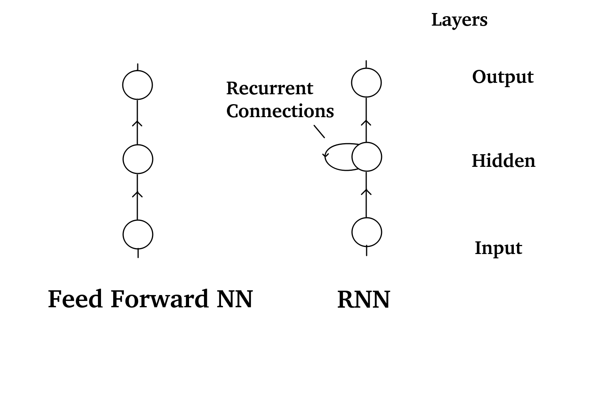
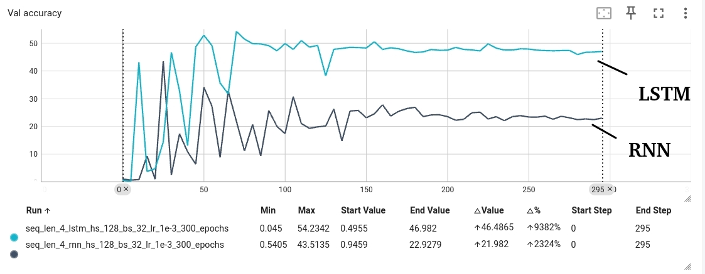

# rnn_101

## TLDR

With this repo, you can train an RNN that predicts the sum of a sequence of digits.

### Setup

Install uv:

    wget -qO- https://astral.sh/uv/install.sh | sh
    uv venv
    source .venv/bin/activate

Train:

    python3 rnn/train.py train.dataset.path=data/seq_len_4.csv [+ optional configs]

<br/>
<br/>

## An introduction to Recurrent Neural Networks

Since I first learned about Neural Networks, I was always afraid of Recurrent Neural Networks, or RNNs. 
Well, maybe not afraid, but I had a good deal of respect for them.
"Normal", so-called feed-forward Neural Networks are conceptually easy. You put data in, 
the Neural Network processes it, feeds the signal forward through the layers and then something comes out.
Not so with RNNs. First of all, you can put a sequence of arbitrary length in them (How?). Then, they 
not only feed the signal forward, but also back to itself? What the .. ?

But what I learned over the years is that (not only) in Machine Learning, sometimes the best way of learning something,
is by doing something. So, in this repo, i am actually doing something with RNNs.

<br/>
<br/>

## The setup

The first thing we need, is a task that an RNN will actually help us with solving.
I came up with the following exercise:


Sum all the digits in a sequence of numbers together and output the result.
Simple enough, right?
Well, actually no. Even for us humans this is not so straightforward for sequences longer than, say, 7 digits.
But how do you teach a computer to do this? We will see this in a minute.
Why exactly this task? No particular reason, it was the first sequence related task that came to my
mind and I wanted to see if I could actually solve it using RNNs.

<br/>
<br/>

## RNN crash course

Before we start diving into how RNNs can help you solve this kind of task, a quick overview.
RNNs are, as the name states, recurrent in nature. This means, that they not only pass information along the layers
as feed-forward NNs do, but also recurrently, within a layer.



As can be seen in this picture, really the only difference between a plain-old NN and an RNN are the 
recurrent connections in the hidden layer. Note, that the single nodes in this picture can represent
multiple, hundreds of nodes, I just did not want to draw more lines than necessary.
So, in principle there is nothing to be afraid of. RNNs = NN + Recurrent connections.
But that does not really help (at least not me) with understanding why RNNs would be suited for sequential tasks.
A different representation sheds some light on the matter.


I added some additional info to this picture, but let's focus on the main difference.
If you take the RNN from before, unpin the recurrent connections, make a copy of the whole network,
place it next to itself and then re-attach the recurrent connection to the copy, then you have
unfolded the RNN. You create exactly as many copies of the network, as you have elements in the input sequence.
Note that the recurrent connections are exactly the same between each of the copies. In more technical terms,
the recurrent weights (denoted here by R) are identical for each copy. So is the layer structure and also the
weights W, between input and hidden layer and V, between hidden and output layer.
With this unfolded RNN, you can feed in the input sequence, one element at a time, to get hidden states $a$ and
outputs $y$ for each element.
And that's basically it. You now have a NN that can process a sequence. And the cool thing is, you can
use all the normal tools for training this NN. You just need some loss function that measures
the difference between the NN outputs $y$ and some targets and let it train on some data.
Of course, the internals of how to calculate gradients and update the weights are a little different,
but that need not be of concern here.

As a quick exercise, think of how you would do the same task without recurrent connections.
You could for example create a network with as many input neurons as there are elements in the sequence.
But then you could not handle sequences of different length. You could condense the sequence down into a fixed-length object, but
then you would loose the sequential information altogether. So RNNs, clearly are a wildly different thing from "normal" NNs.

<br/>
<br/>

## Data

Now that we know what we are dealing with, let's take a quick look at the data.
For the task at hand, the training data is quite easy to obtain. Just generate a bunch of strings of numbers,
together with their sum. Done. The devil lies in the details of course, but we will get to that in a moment.
Since I did not want to rent a beefy GPU machine and also did not want to spend too much time waiting for training
to be finished, I decided to restrict data generation to sequences of length up to 4. Quick maths, shows,
that this entails 10^4 training samples. Not overwhelming, but should be good enough for starters.
The `create_dataset.py` script can be used to create such a dataset in the form of a .csv file.

Of course, you can't just feed integers into a NN, so you need a way to represent numbers as tensors.
One-hot-encoding is a neat and easy way to do this. The digits from 0 to 9, together with two special
symbols EOS and EOA (which stands for end-of-sequence and end-of-answer, respectively), are encoded as 12 distinct 12-dimensional tensors.
Each tensor containing a 1 in the respective dimension and all 0s otherwise.

A quick remark about batching. Usually, batching is quite easy, since for standard NNs, all inputs are of the same shape.
But for sequences of unequal length, the inputs actually differ in shape. To make matters worse, also the targets differ in shape.
E.g. The input 1294 sums up to 16, but the input 1221 sums up to 6. Since pytorch can only handle batches with inputs of same shape and
targets with same shape (but maybe different than input shape), I had to write my custom batching logic. This was actually the hardest part in 
the whole project!
Encoding, batching, data loading and other related functionalities can all be found in the `data.py` module.

<br/>
<br/>

## Training

Now for the actual training. The training logic is quite straightforward and does not differ from how you would train a feed-forward NN.
First, we instantiate our RNN model, then load the data and do some house-keeping for the logs. The training loop also does not do anything fancy; loop over the train dataset (a torch DataLoader object) in batches, calculate the loss, backprop the gradients, etc.
The loss function is just Cross Entropy implemented in a slightly different way to handle one-hot encodings.
 The only special thing here is our validation metric. I don't just calculate the loss on the validation dataset (which is interesting, but does not really tell you how good the model is performing), but also the accuracy. And to calculate the accuracy, you actually need to unfold the RNN. This is done with the `sample_from_rnn` function in `misc.py`. And that's it. We can now let our RNNs loose!

Training code is in the `train.py`. You can run it with:

    python3 rnn/train.py

There are several command-line arguments for setting training parameters, hyper-parameters or paths.
E.g. you can choose the number of training epochs via the train.n_epochs arg:

    python3 rnn/train.py train.n_epochs=300

For a complete set of CL-args, see [Configs](#configs)

<br/>
<br/>

## Results

I trained an RNN on the length-up-to-4 sequence data for 300 epochs.
Here are the results


Train loss looks pretty much as you would want it to look; it keeps creeping down until it more or less settles ath around 250 epochs. Same picture for the validation loss: 


As you can see the start is much more noisy, but at the end we arrive at nice and low loss. But is that actually good? Well, you can't really tell from just the loss, can you? That's why I also included the validation accuracy:


Now this already tells us much more. Namely, that the RNN sucks pretty hard at this task! A whooping 23% accuracy at the end of training. Meaning, that the RNN could determine the digit sum for only 23% of the sequences in the validation set. (As a side note: I know that the axes in these plots are not labeled. Unfortunately, tensorboard, where I got these plots from, does not label the axes very nicely.)
 Luckily, there is a very simple remedy. Any time you work with RNNs, there is an (almost) guaranteed way to improve on performance. And that is, to replace your RNNs with LSTMs. LSTM stands for Long Short-Term Memory and is an RNN architecture invented by Sepp Hochreiter (Go Sepp!) et.al. already back in the 1990s.
I won't go into the details of how LSTMs actually work (maybe that is something for a later project). For now, think of LSTMs simply as an RNN that has more complex hidden units. The principal is the same however, you unfold the LSTM in time just as described above.
Training an LSTM is no different from training an ordinary RNN, you can just select it via the CL-arg:

    model.model_type=lstm




Wow, that was easy. Just by switching the RNN with an LSTM (all hyperparemters left unchanged), we get an accuracy of around 47%. More than twice as good!.


## Play with hyper-parameters

When you run `train.py` with default configs, it will choose a hidden size of 128, a learning rate of $10^{-3}$ and a batch size of 32, without any regularization.
You can play around with hyper-parameters by giving the appropriate configs as CL-args.

For example, we can vary the batch size:


It seems that a batch size of 64 tends to work very good. You should keep in mind, that these are just single sample estimates, so the results should be taken with a grain of salt.

Or we can tinker with the hidden size:


The run with hidden size = 64 and batch size = 32 is especially impressive, because it achieved a final validation accuracy of almost 74% !!


## Going further

Now that we did train a promising RNN (LSTM) for predicting the sum of 4-digit sequences, we can check if it generalizes to longer sequences.
I created a dataset, that consists of only sequences of 5 digits for this purpose. Remember that the RNN never saw a sequence that long in its whole life. So by runing it on longer sequences, we can tap into its generalization performance.
The `test.py` script can be fed with the trained weights of an RNN and a either a specific sequence to run it on, or a complete dataset of sequences. Be careful to use the correct `model.model_type` and `model.hidden_size` arguments when running.

For example:

```bash
python3 rnn/test.py model.model_type=lstm model.hidden_size=64 test.model_path=logs/seq_len_4_lstm_hs_64_bs_32_lr_1e-3_300_epochs/best_model.pth test.sequence=12345

Test model on input:
12345
Answer: 1 3 EOA, False
```

Hmm, that already does not look very good. The answer should be 15, but our model predicted 13. But this was only one example, let's run it on all sequences of length 5 and see if it was just unlucky.

```bash
python3 rnn/test.py model.model_type=lstm model.hidden_size=64 test.dataset_path=data/seq_len_5_only.csv test.model_path=logs/seq_len_4_lstm_hs_64_bs_32_lr_1e-3_300_epochs/best_model.pth

...
Accuracy on dataset: data/seq_len_5_only.csv
3.44%
```

Nope, it was not. The model is suddenly really bad in calculating sums.
This is not an uncommon theme in sequence modelling. Extrapolating to longer sequences than seen in training is quite difficult for RNNs.
What could we do to improve it?
There are some obvious and some less obvious things we could try.
An obvious thing would be to also include longer sequences in the training data. What also is often a good idea is to make the model bigger (and therefore hopefully better) by adding additional layers (so-called multi-layer RNNs).
An often overlooked possibility would be to play around with regularization to prevent overfitting on specific sequence lengths. 
Dropout or weight decay are two possible strategies here.
Have fun experimenting.

<br/>
<br/>

## Configs

The customizable configs (including hyper-parameters) can be found in the `config.yaml`.

```yaml
description: "Training configs for Digit-sum RNN"

model:
  model_type: rnn
  hidden_size: 128

train:
  dataset_path: null
  n_epochs: 100
  learning_rate: 1e-3
  train_split_fraction: 0.8
  batch_size: 32
  log_path: logs
  run_name: null
  weight_decay: null

test:
  dataset_path: null
  model_path: null
  sequence: null
```

I use hydra for working with configs in this repo.
You can set each of these configs via the command-line by giving the nested config, e.g.:

    python3 rnn/train.py train.n_epochs=300

